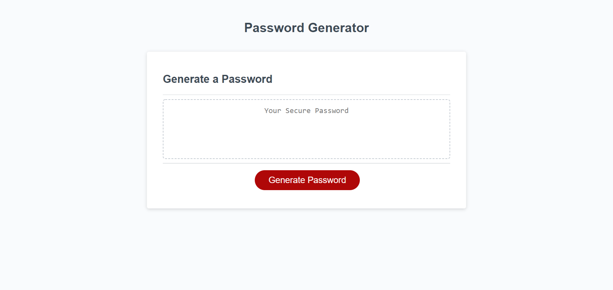

# password-generator
# Screenshot:

## Password generator developed with javascript.

## Website will ask to input the length of the password and then ask either the password will contain lowercase, uppercase, numeric value or / and special characters through confirm window.

## If length is lower than 8 or greater than 128 the program will send a alert message and also display the message in the website.

## variable charSet will add values depending on the type chosen

## If none of the following: lowercase, uppercase, numeric value or / and special characters, is chosen, the program will give an alert box and also display message that you must choose any of the values to generate password.

link to the site: https://ryan7998.github.io/password-generator/